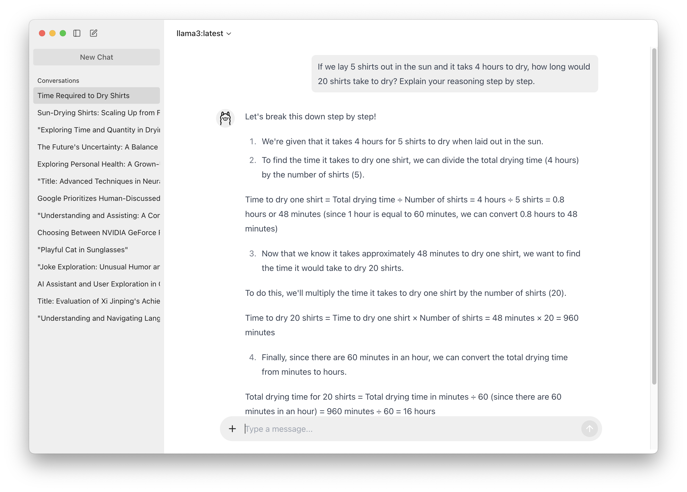

# Ollamate


**Ollamate: Ollama Desktop Client for Everyday Use**

Ollamate is an open-source ChatGPT-like desktop client built around Ollama, providing similar features but entirely local. It leverages local LLM models like Llama 3, Qwen2, Phi3, etc. via Ollama, ensuring privacy and offline capability.



## Features

- **Local LLM Models**: Use opensource LLMs locally like Llama 3, Qwen2, and Phi3
- **User-Friendly**: Simple binary download for end users with Ollama installed (Apple Silicon Mac for now. Windows and Linux later).
- **Developer-Friendly**: Open-source and ready for contributions on GitHub.

## Installation

### For End Users

1. Ensure you have [Ollama](https://ollama.com) installed on your system. Make sure you have at least one model downloaded. (For example, Run `ollama run phi3`)
2. Download the binary from [Github]([https://](https://github.com/humangems/ollamate/releases)).
3. Use it just like a normal app.

### For Developers

1. Fork the repository on GitHub.
2. Clone your forked repository to your local machine.
3. Install dependencies and run the app.

```bash
git clone https://github.com/humangems/ollamate.git
cd ollamate
yarn install
yarn dev
```

## Tech stack

- **Electron**: For building the cross platform desktop application.
- **React and Redux**: For building the user interface and state management

## Contributing

We welcome contributions from the community. To contribute:

1. Fork the repository.
2. Create a new branch (`git checkout -b feature-branch`).
3. Make your changes.
4. Commit your changes (`git commit -m 'Add new feature'`).
5. Push to the branch (`git push origin feature-branch`).
6. Create a pull request.

## License

This project is licensed under the MIT License. See the [LICENSE](LICENSE) file for more details.

## Contact

For any inquiries or support, please open an issue on GitHub.

---

Thank you for using Ollamate! We hope it enhances your local LLM experience.
